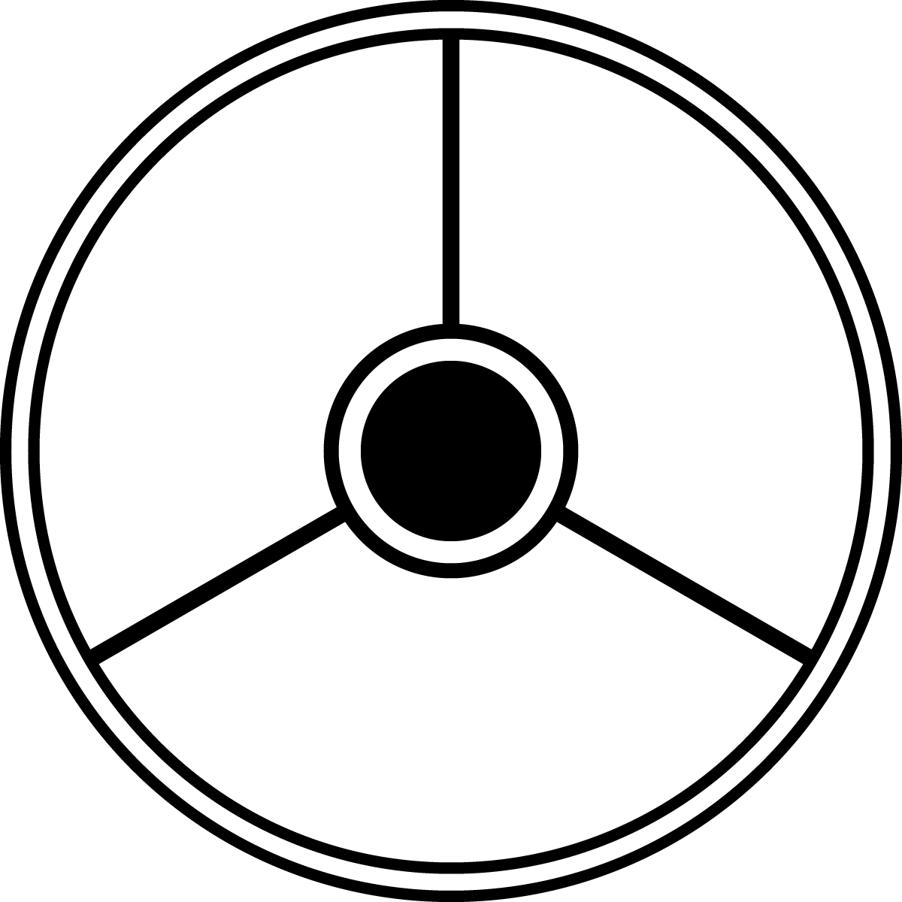

# stoicism-logo
Vector logo for Stoicism

Meanings

1. Inner, outer circle = Dichotomy of control
2. Thirds = Desire, Action, Assent (Physics, Ethics, Logic)

The logo is licensed under https://creativecommons.org/licenses/by/4.0/
